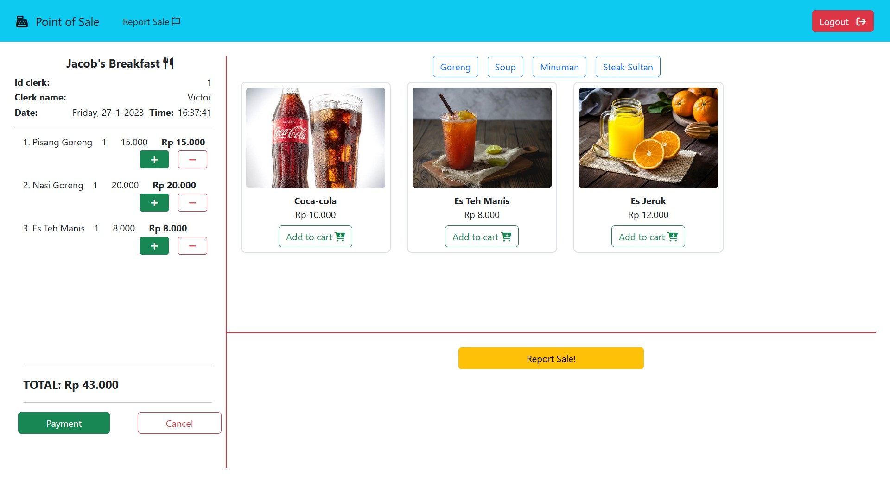

# Point of Sale Restaurant


<br>
<br>

---
## How to initialize (requirement instalation)
1. Initialize `VueJS` and other library
```sh
cd vuejs
npm install
npm install --save mitt
npm install --save axios vue-axios
```

2. Initialize python `FLASK` and other library
```sh
python-flask\env\Scripts\activate

pip install flask
pip install flask-sqlalchemy
py -m pip install requests
pip install mysqlclient
pip install mysql-connector

pip install Flask-Cors==3.0.10
pip install Flask==2.1.0
pip install flask-sqlalchemy==2.5.1
```
<br>
<br>

---
## How to run this project:
> To run this project, you need to prepare 2 termninal (cmd). <br>
The first one is to activate `FLASK` and <br>
the second one is to activate `VueJS`

> Python `FLASK` is for back-end, to connect database. <br>
And `VueJS` is for front-end.

<br>
<br>

> ### NOTE: <br>
Make sure to activate WAMP/XAMP and IMPORT .sql file to your database/PHPMyAdmin


<br>

1. [First cmd] Activate python virtual environment (venv) and run `FLASK`, simply just copy this code below

```sh
python-flask\env\Scripts\activate
cd python-flask\package
flask run
```

2. [Second cmd] Run `VueJS`

```sh
cd vuejs
npm run dev
```

3. Finally, open the link on the second cmd. <br>
The link looks like this: http://localhost:5173/
<br>
<br>

---
## Username to login
1. > username: Victor <br> password: 12345678
2. > username: Jacob <br> password: 87654321
3. > username: Filbert <br> password: qwerasdf
